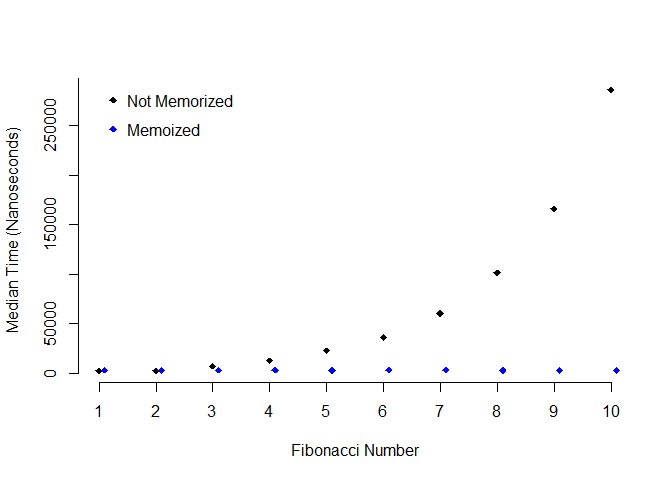

Functional Programming
================

## What is Functional Programming?

Functional programming is a programming philosophy based on lambda
calculus. It concentrates on four constructs:

1.  Data
2.  Variables (function arguments)
3.  Functions
4.  Function applications (evaluating functions given arguments and/or
    data)

With functional programming, we can consider passing functions as the
argument to a function and a function can return another function as its
result.

``` r
adder_maker <- function(n){
  function(x){
    n + x
  }
}

add2 <- adder_maker(2)
add3 <- adder_maker(3)

add2(5)
```

    ## [1] 7

``` r
add3(5)
```

    ## [1] 8

## Map

The `purrr::map()` family of functions applies a function to the
elements of a data structure (usually a vector/list). The function is
applied once to each element of the vector, with that element being
passed to the first argument of the function. The output is a new
vector/list but now each element is the returned result of the applied
function. While all of the `map_*` functions operate in the same manner,
the differences lie in the types of list/vectors returned:

-   `map()` returns a list
-   `map_lgl()` returns a vector of logicals
-   `map_chr()` returns a character vector
-   `map_dbl()` returns a numeric vector

``` r
purrr::map_chr(c(5, 4, 3, 2, 1), function(x) {c("one", "two", "three", "four", "five")[x]})
```

    ## [1] "five"  "four"  "three" "two"   "one"

``` r
purrr::map_lgl(c(1, 2, 3, 4, 5), function(x){x > 3})
```

    ## [1] FALSE FALSE FALSE  TRUE  TRUE

The `purrr` library also has `map` functions that modify vectors based
on certain conditions. For instance, the `map_if` function takes an
additional argument for a *predicate* function that returns a `TRUE` or
`FALSE` for each element of the vector based on some condition. This
logical vector is then used to determine which elements of the vector
are modified and others left unchanged.

Here we are replacing every even number of a vector with its square.

``` r
library(dplyr)
library(purrr)

map_if(1:5, 
       # predicate function
       function(x){x %% 2 == 0},
       # function to apply
       function(y){y^2}) %>% 
        unlist()
```

    ## [1]  1  4  3 16  5

`map_at` is similar, but takes a numeric vector as its second argument,
where each of element of the vector represents the indices of the data
vector to modify.

Here we are subracting 10 from the elements in the 1, 3, and 5 position
of the data vector.

``` r
map_at(seq(100, 500, 100), 
       c(1, 3, 5), 
       function(x){x - 10}) %>% 
        unlist()
```

    ## [1]  90 200 290 400 490

So far we have only worked with one data structure, but `purrr` also
provides `map2` (and related variants) for apply a function over two
data structures.

For example, we can pass a list of the letters of the alphabet and an
integer sequence 1 to 16 to `map2_chr` and apply `paste` to these
inputs.

``` r
map2_chr(letters, 1:26, paste)
```

    ##  [1] "a 1"  "b 2"  "c 3"  "d 4"  "e 5"  "f 6"  "g 7"  "h 8"  "i 9"  "j 10"
    ## [11] "k 11" "l 12" "m 13" "n 14" "o 15" "p 16" "q 17" "r 18" "s 19" "t 20"
    ## [21] "u 21" "v 22" "w 23" "x 24" "y 25" "z 26"

Finally, for instances where we need three or more data structures,
there is `pmap`. One key difference is instead of passing each data
structure as a separate argument, we pass them together as a nested
list.

``` r
pmap_chr(list(
  list(1, 2, 3),
  list("one", "two", "three"),
  list("uno", "dos", "tres")
), paste)
```

    ## [1] "1 one uno"    "2 two dos"    "3 three tres"

## Reduce

List or vector reduction iteratively combines the first element of a
vector with the second element of a vector, combining that result with
the third element of the vector, and so on until the end of the vector
is reached. The applied function should take a least two arguments.
Also, while `map` will return a vector or list, `reduce` should return a
single value.

``` r
reduce(c(1, 3, 5, 7), function(x, y){
  message("x is ", x)
  message("y is ", y)
  message("")
  x + y
})
```

    ## x is 1

    ## y is 3

    ## 

    ## x is 4

    ## y is 5

    ## 

    ## x is 9

    ## y is 7

    ## 

    ## [1] 16

By default `reduce` starts with the first element of the vector,
followed by the second element, and so on. However, we can use
`.dir = "backward"` to reverse the order of iteration.

``` r
reduce(letters[1:4], function(x, y){
  message("x is ", x)
  message("y is ", y)
  message("")
  paste0(x, y)
}, .dir = "backward")
```

    ## x is c

    ## y is d

    ## 

    ## x is b

    ## y is cd

    ## 

    ## x is a

    ## y is bcd

    ## 

    ## [1] "abcd"

## Search

`has_element()` will search a vector for a specified element and return
`TRUE` if a match is found (otherwise `FALSE`).

``` r
has_element(letters, "a")
```

    ## [1] TRUE

``` r
has_element(letters, 1)
```

    ## [1] FALSE

`detect()` takes a vector and predicate function and returns the first
element of the vector for which the predicate function returns `TRUE`

``` r
detect(20:40, function(x){
  x > 22 && x %% 2 == 0})
```

    ## [1] 24

`detect_index()` works the exact same, except now it returns the index
of the first element of the vector for which the predicate function
returns `TRUE`.

``` r
detect_index(20:40, function(x){
  x > 22 && x %% 2 == 0
})
```

    ## [1] 5

## Filter

`purrr` also provides a set of functions that are known as filter
functions. These are

-   `keep`
-   `discard`
-   `every`
-   `some`

Each of these functions take a vector and predicate function as their
inputs.

`keep` returns a vector containing every element of the original vector
that satisfied the predicate function.

``` r
keep(1:20, function(x){
  x %% 2 == 0
})
```

    ##  [1]  2  4  6  8 10 12 14 16 18 20

`discard` does the opposite, returning every element that does not
satify the predicate.

``` r
discard(1:20, function(x){
  x %% 2 == 0
})
```

    ##  [1]  1  3  5  7  9 11 13 15 17 19

Finally, the `every` and `some` functions return a single logical value.
`every` only returns `TRUE` if every element of the vector satifies the
predicate function.

`some` returns `TRUE` if at least one element of the vector satisfies
the predicate function.

``` r
every(1:20, function(x){
  x %% 2 == 0
})
```

    ## [1] FALSE

``` r
some(1:20, function(x){
  x %% 2 == 0
})
```

    ## [1] TRUE

## Compose

The `compose` function combines any number of functions into one
function:

``` r
n_unique <- compose(length, unique)
rep(1:5, 1:5)
```

    ##  [1] 1 2 2 3 3 3 4 4 4 4 5 5 5 5 5

``` r
n_unique(rep(1:5, 1:5))
```

    ## [1] 5

## Partial Application

Partial application of functions can allow functions to behave a bit
like data structures. The `partial` function from `purrr` lets you
specify some of the arguments of a function. It then returns a function
that only takes the remaining unspecified arguments.

``` r
mult_three_n <- function(x, y, z){
        x * y * z
        }

mult_by_15 <- partial(mult_three_n, x = 3, y = 5)

mult_by_15(z = 4)
```

    ## [1] 60

This is useful for binding data to some arguments of a function before
using that function elsewhere.

## Recursion

Recursive functions have two main parts: a few easy to solve problems
called *base cases*, and then a case for a more complicated problem
where **the function is called inside of itself**.

To see how this works, first let’s start with a function that adds
together all the numbers in a vector. One way to accomplish this is with
a loop:

``` r
vector_sum_loop <- function(v){
  result <- 0
  for(i in v){
    result <- result + i
  }
  result
}

vector_sum_loop(c(5, 40, 91))
```

    ## [1] 136

If instead we wanted to do this recursively, we have to fist consider
what is the base case of finding a sum of a vector? The sum of a vector
of length 1 would be itself, and the more complicated case would be a
vector with more than one element. Once we have handled the base case,
we can remove that element from the vector, but now what do we do? Well
we just call the function on the more complicated case, and then add the
cumulative sum to this remaining vector.

``` r
vector_sum_rec <- function(v){
  if(length(v) == 1){
    v
  } else {
    v[1] + vector_sum_rec(v[-1])
  }
}

vector_sum_rec(c(5, 40, 91))
```

    ## [1] 136

Another classic example in recursion is the Fibonacci sequence. The
sequence starts 0, 1 and each additional number in the sequence is
defined as the sum of the previous two numbers. Therefore, we have 0, 1,
1, 2, 3, 5, 8, … and so on.

To write a function that computes the nth digit in the sequence, we have
to consider three base cases:

1.  n must be greater than 0.
2.  When n is equal to 1, return 0.
3.  When n is equal to 2, return 1.

And then the recursive case:

-   Otherwise return the sum of the
    *F*<sub>*n* − 1</sub> + *F*<sub>*n* − 2</sub>

``` r
fib <- function(n) {
        # base case 1: n > 0
        stopifnot(n > 0)
        # base case 2: n = 1, F = 0
        if(n == 1) {
                0
        # base case 3: n = 2, F = 1
        } else if (n == 2) {
                1
        # recursive case: F_(n-1) + F_(n-2)
        } else {
                fib(n - 1) + fib(n - 2)
        }
}

map_dbl(1:7, fib)
```

    ## [1] 0 1 1 2 3 5 8

While this is an elegant approach to the problem, it results in a lot of
wasted computation. Underneath recursive call to `fib` results in the
same computation multiple times.

Consider `fib(6)`:

-   recursive case calls `fib(5) + fib(4)`
-   `fib(5)` then calls `fib(4) + fib(3)`, which then calls
    `fib(3) + fib(2)` and `fib(2) + fib(1)`
-   at the same time `fib(4)` is called again, which then calls
    `fib(3) + fib(2)` again

This duplication of computation is wastful, and can get very expensive
for large n. 

To address this, we can use a technique called memoization. Memoization
stores the value of each calculated Fibonacci number so that once its
calculated we can just look up the value instead.

First, we’ll create a placeholder table `fib_tbl` which is full of
`NA`s. Within the function, we’ll first check this table to see if the
number is in the table, and if true return that value. Otherwise the
recursive calculation will be performed. Note that to assign values to
the table within the function, we’ll use `<<-`.

``` r
fib_tbl <- c(0, 1, rep(NA, 23))

fib_mem <- function(n) {
        stopifnot(n > 0)
        
        if(!is.na(fib_tbl[n])) {
                fib_tbl[n]
        } else {
                fib_tbl[n - 1] <<- fib_mem(n - 1)
                fib_tbl[n - 2] <<- fib_mem(n - 2)
                fib_tbl[n - 1] + fib_tbl[n - 2]
        }
}

map_dbl(1:12, fib_mem)
```

    ##  [1]  0  1  1  2  3  5  8 13 21 34 55 89

But is it actually faster? We can compare the two implementations using
`microbenchmark`.

``` r
library(purrr)
library(microbenchmark)
library(tidyr)
library(magrittr)
library(dplyr)

fib_data <- map(1:10, function(x){microbenchmark(fib(x), times = 100)$time})
names(fib_data) <- paste0(letters[1:10], 1:10)
fib_data <- as.data.frame(fib_data)

fib_data %<>%
  gather(num, time) %>%
  group_by(num) %>%
  summarise(med_time = median(time))

memo_data <- map(1:10, function(x){microbenchmark(fib_mem(x))$time})
names(memo_data) <- paste0(letters[1:10], 1:10)
memo_data <- as.data.frame(memo_data)

memo_data %<>%
  gather(num, time) %>%
  group_by(num) %>%
  summarise(med_time = median(time))

plot(1:10, fib_data$med_time, xlab = "Fibonacci Number", ylab = "Median Time (Nanoseconds)",
     pch = 18, bty = "n", xaxt = "n", yaxt = "n")
axis(1, at = 1:10)
axis(2, at = seq(0, 350000, by = 50000))
points(1:10 + .1, memo_data$med_time, col = "blue", pch = 18)
legend(1, 300000, c("Not Memorized", "Memoized"), pch = 18, 
       col = c("black", "blue"), bty = "n", cex = 1, y.intersp = 1.5)
```

<!-- -->

The plot comparison reveals the original functions grows exponentially
in time to calculate while the memoized version remains constant.
